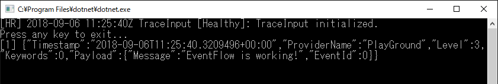

# Mamemaki.EventFlow.HealthReporters.StdOutput

## Introduction
This is a custom health reporter for [Microsoft.Diagnostics.EventFlow] to write to the console window.

The general flow of the process:

1. If the report level is less than `minReportLevel` value, skip the process.
1. Construct message string by corresponding to `messageFormat` value.
1. Output message string to STDOUT. If `outputToStdError` is true, output to STDERR instead of STDOUT.

## Getting Started

To quickly get started, you can create a simple console application in VisualStudio as described below or just download and run [PlayGround](PlayGround) project.

### 1. Install NuGet packages

```powershell
PM> Install-Package Microsoft.Diagnostics.EventFlow.Inputs.Trace
PM> Install-Package Microsoft.Diagnostics.EventFlow.Outputs.StdOutput
PM> Install-Package Mamemaki.EventFlow.HealthReporters.StdOutput
```

### 2. Add "eventFlowConfig.json"
Add a JSON file named "eventFlowConfig.json" to your project and set the Build Action property of the file to "Copy if Newer". Set the content of the file to the following:

```js
{
  "inputs": [
    {
      "type": "Trace",
      "traceLevel": "Warning"
    }
  ],
  "outputs": [
    {
      "type": "StdOutput"
    }
  ],
  "healthReporter": {
    "type": "StdOutputHealthReporter",
    "minReportLevel": "Healthy",
    "outputToStdError": "false",
    "messageFormat": "[HR] ${TimeStamp} ${Context} [${Level}]: ${Message}"
  },
  "schemaVersion": "2016-08-11",
  "extensions": [
    {
      "category": "healthReporter",
      "type": "StdOutputHealthReporter",
      "qualifiedTypeName": "Mamemaki.EventFlow.HealthReporters.StdOutput.StdOutputHealthReporter, Mamemaki.EventFlow.HealthReporters.StdOutput"
    }
  ]
}
```

### 3. Create an EventFlow pipeline
Create an EventFlow pipeline in your application code using the code below. Run your application and see your traces in console output.
```csharp
    using (var pipeline = DiagnosticPipelineFactory.CreatePipeline("eventFlowConfig.json"))
    {
        System.Diagnostics.Trace.TraceWarning("EventFlow is working!");
        Console.WriteLine("Press any key to exit...");
        Console.ReadKey(intercept: true);
    }
```



## Configuration Details

### Health reporter parameters

Parameter  | Description | Required(default)
------------- | ------------- | -------------
`type` | Type of health reporter. It must be set `StdOutputHealthReporter`. | Yes(`StdOutputHealthReporter`)
`minReportLevel` | Specifies the collection report level. Report traces with equal or higher severity than specified are collected. For example, if Warning is specified, then Problem, and Warning traces are collected. Default is `Problem`. Allowed values are `Healthy`, `Warning`, or `Problem`. | No(`Problem`)
`suppressEmptyMessage` | If set true, skip report if message is empty. | No(`false`)
`outputToStdError` | If set true, write to stderr. If false, write to stdout. | No(`false`)
`messageFormat` | Format of the output message. For more details, see [Message format](#message-format) | No(`${TimeStamp} ${Context} [${Level}] ${Message}`)

### Message format

You can set the message format for customizing output string. The format token will be replaced by the corresponding value.

The following format tokens are available:

Name | Description
------------- | ------------- 
`${Timestamp}` | Timestamp of the event
`${Context}` | Context(Usually class name) of the event
`${Level}` | Report level name of the event
`${Message}` | Message text of the event


[Microsoft.Diagnostics.EventFlow]: https://github.com/Azure/diagnostics-eventflow
